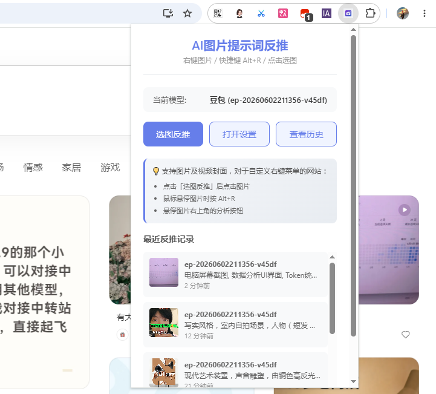
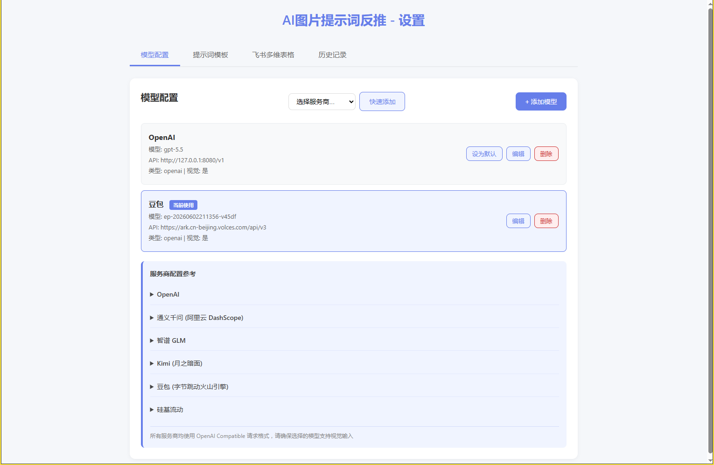
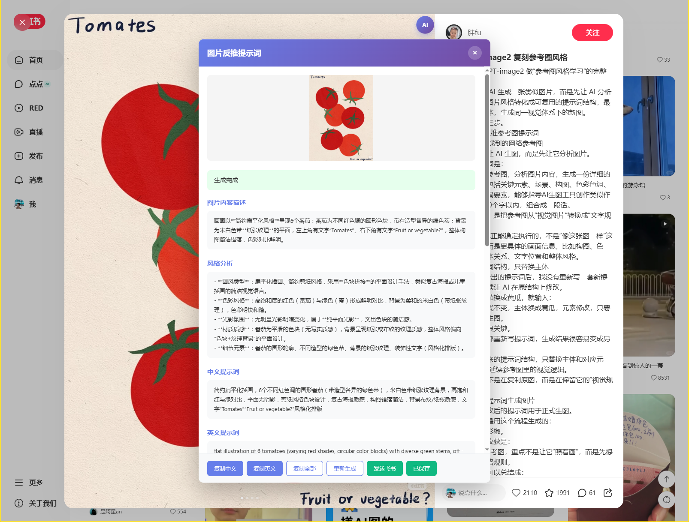
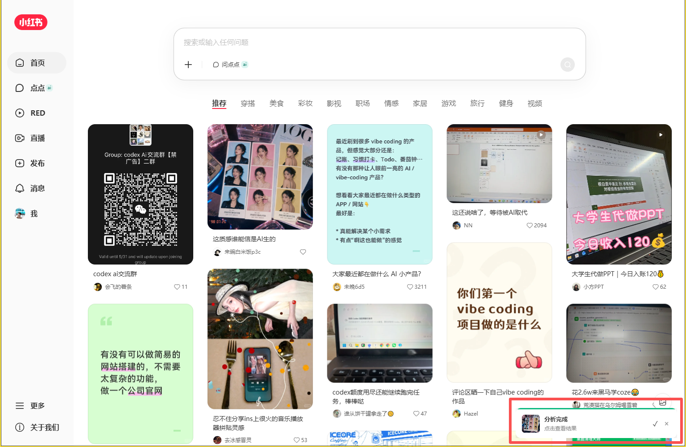
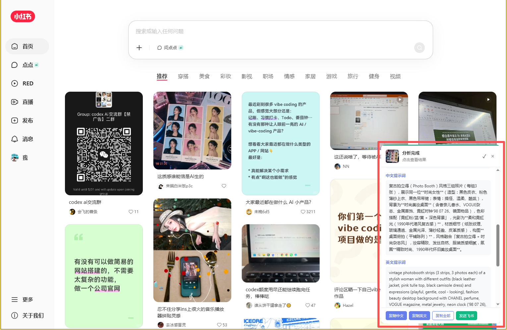
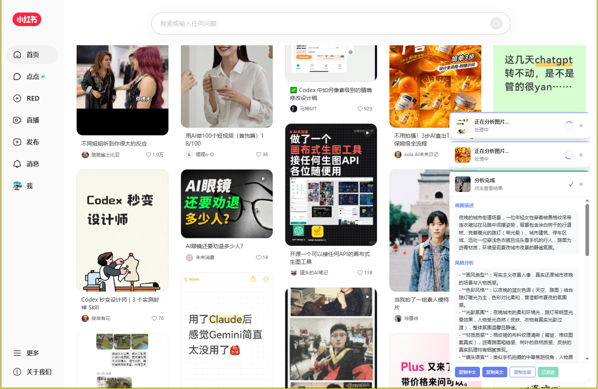
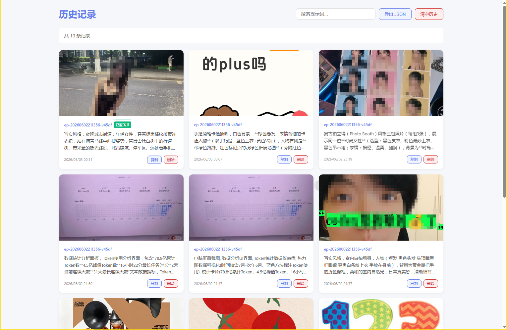
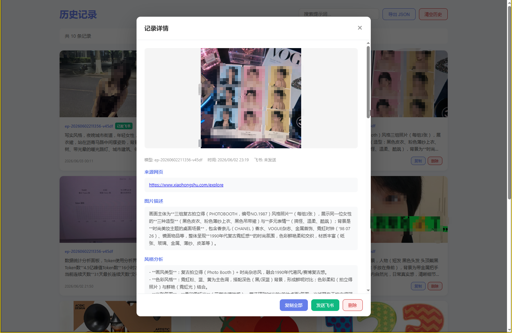
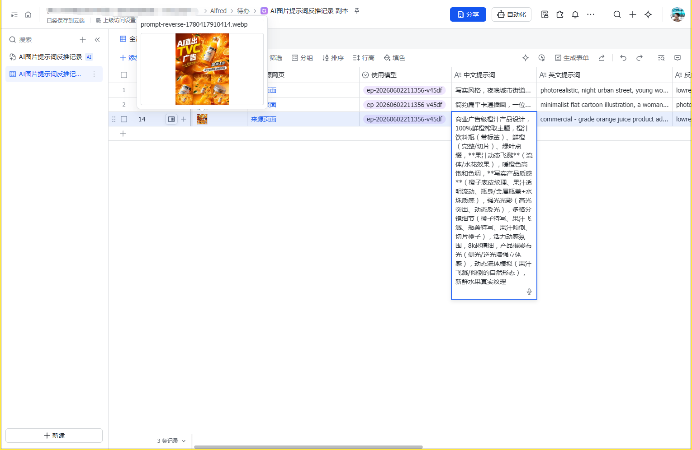
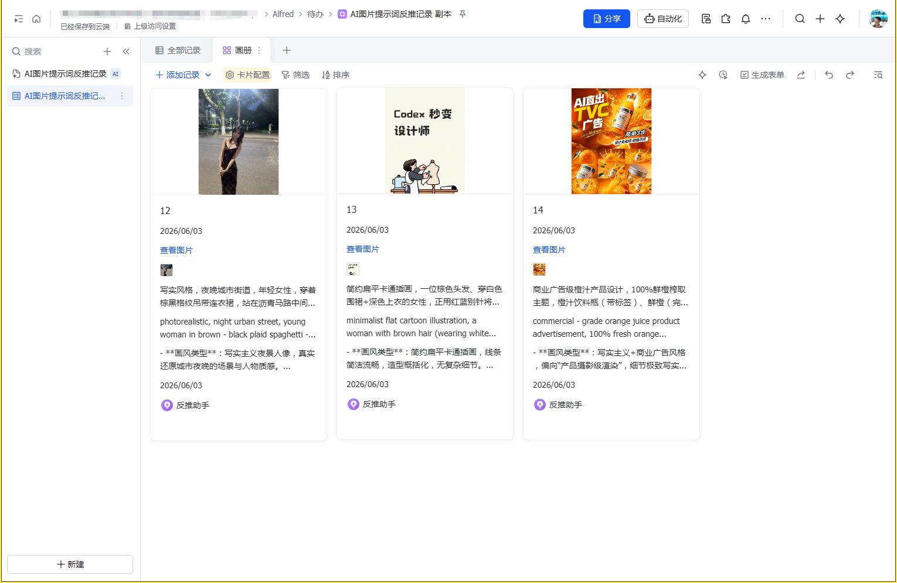

# AI 图片提示词反推 - Chrome 扩展

一款基于 AI 视觉大模型的 Chrome 浏览器扩展，右键点击任意图片即可反推出适用于 Midjourney / Stable Diffusion / DALL·E 等平台的提示词（Prompt）。

## 功能特性

- **多种触发方式** — 右键菜单、Popup 选择器、Alt+R 快捷键、悬浮 AI 按钮
- **多服务商支持** — 通义千问、智谱 GLM、Kimi、豆包、OpenAI、硅基流动，一键配置
- **智能图片获取** — 4 层回退策略 + 防盗链绕过，适配各类网站（包括花瓣、小红书等自定义右键的站点）
- **结构化输出** — 自动解析为中文提示词、英文提示词、反向提示词、风格分析、画面描述
- **历史记录** — 本地持久化存储，支持搜索、分页、导出 JSON
- **飞书多维表格备份** — 自动写入飞书多维表格，支持表格/画册视图浏览
- **Shadow DOM 隔离** — UI 完全隔离，不影响原网页样式

## 界面预览

### Popup 弹出页
点击浏览器工具栏扩展图标即可打开。显示当前模型状态、快捷操作入口和最近反推记录。



### 设置页 - 模型配置
支持一键选择服务商快速添加模型，也可手动填写自定义 API 地址。内置 6 大服务商配置参考（OpenAI、通义千问、智谱 GLM、Kimi、豆包、硅基流动），含各平台 Base URL、视觉模型名称和开发者平台快捷链接。



### 反推结果面板
反推完成后弹出结果浮层，包含画面描述、风格分析、中英文提示词、反向提示词等结构化内容，每个区块均可一键复制。适配小红书等各类网站。



### 右下角通知卡片
反推过程以右下角通知卡片呈现，不遮挡页面浏览。支持最多 3 张图片并发处理，超出部分自动排队，处理完成后展示结果摘要。







### 历史记录页
所有反推结果自动保存，支持搜索、分页浏览、导出 JSON。点击卡片可展开查看完整的图片描述、风格分析和提示词详情。





### 飞书多维表格备份
开启后每次反推结果自动写入飞书多维表格，支持表格视图和画册视图，方便管理和检索历史反推记录。





## 快速开始

### 第一步：安装扩展

1. 下载本项目（点击页面右上角绿色 **Code** 按钮 → **Download ZIP**）
2. 解压到本地任意目录
3. 打开 Chrome 浏览器，地址栏输入 `chrome://extensions/` 回车
4. 打开右上角的 **开发者模式** 开关
5. 点击 **加载已解压的扩展程序**
6. 选择解压后的 `chrome-image-prompt-reverse` 文件夹
7. 安装完成，工具栏会出现扩展图标

> **Edge 浏览器**同样适用，地址输入 `edge://extensions/` 操作步骤相同。

### 第二步：配置 AI 模型

1. 右键点击工具栏的扩展图标 → **选项**（或点击 Popup 中的「设置」）
2. 在「模型配置」标签页，从下拉框选择你的 AI 服务商（如「通义千问」）
3. 点击 **快速添加** — Base URL 和模型名会自动填入
4. 粘贴你的 **API Key**，点击 **保存**
5. 点击 **测试连接** 验证配置是否正确

#### 支持的服务商

| 服务商 | Base URL | 视觉模型 |
|--------|----------|----------|
| OpenAI | `https://api.openai.com/v1` | `gpt-4o` / `gpt-4o-mini` |
| 通义千问 | `https://dashscope.aliyuncs.com/compatible-mode/v1` | `qwen-vl-max` / `qwen-vl-plus` |
| 智谱 GLM | `https://open.bigmodel.cn/api/paas/v4` | `glm-4v` / `glm-4v-flash` |
| Kimi | `https://api.moonshot.cn/v1` | `moonshot-v1-8k-vision` |
| 豆包 (火山引擎) | `https://ark.cn-beijing.volces.com/api/v3` | 控制台 Endpoint ID |
| 硅基流动 | `https://api.siliconflow.cn/v1` | 平台托管视觉模型 |

> 所有服务商均使用 **OpenAI Compatible** 请求格式，请确保选择的模型支持视觉输入。

### 第三步：开始使用

#### 方式一：右键菜单（常规网站）
右键点击图片 → 选择 **反推提示词**

#### 方式二：Popup 选择器（自定义右键的网站，如花瓣、小红书）
1. 点击工具栏扩展图标打开 Popup
2. 点击 **选择图片反推**
3. 页面进入选择模式，点击图片即可分析
4. 按 ESC 取消

#### 方式三：快捷键 Alt+R
将鼠标悬停在目标图片上，按 **Alt+R** 直接反推

#### 方式四：悬浮 AI 按钮
鼠标悬停在图片上时，图片右上角会出现 **AI** 按钮，点击即可反推

## 功能说明

### 结果面板

反推完成后会弹出结果面板，包含：
- **画面描述** — AI 对图片内容的自然语言描述
- **风格分析** — 画风、光线、构图等分析
- **中文提示词** — 可直接用于国内 AI 绘图工具
- **英文提示词** — 适用于 Midjourney / Stable Diffusion / DALL·E
- **反向提示词** — Negative Prompt
- **原始回复** — 模型返回的完整文本

每个区块均支持一键复制，也可将整个结果保存到飞书。

### 历史记录

- 每次反推结果自动保存到本地
- 在 Popup 中可查看最近记录
- 点击「查看全部」打开历史页面，支持搜索和分页
- 支持导出 JSON 文件
- 可在设置页调整最大保存条数

### 飞书多维表格备份

1. 在[飞书开放平台](https://open.feishu.cn)创建自建应用，获取 App ID 和 App Secret
2. 创建一个飞书多维表格，从 URL 中获取 App Token 和 Table ID
3. 在设置页「飞书多维表格」标签页填入配置并开启自动备份
4. 开启后每次反推结果会自动写入多维表格，可在飞书中查看和管理

## 项目结构

```
chrome-image-prompt-reverse/
├── manifest.json              # 扩展配置
├── background.js              # Service Worker（菜单、消息路由、API 调用）
├── content.js                 # 内容脚本（UI、图片处理、选择器模式）
├── assets/                    # 图标资源
├── options/                   # 设置页
│   ├── options.html
│   ├── options.js
│   └── options.css
├── popup/                     # 弹出页
│   ├── popup.html
│   ├── popup.js
│   └── popup.css
├── history/                   # 历史记录页
│   ├── history.html
│   ├── history.js
│   └── history.css
└── utils/                     # 工具模块
    ├── storage.js             # Chrome Storage 封装
    ├── models.js              # AI 模型调用
    ├── image.js               # 图片处理
    ├── feishu.js              # 飞书多维表格 API
    └── promptTemplate.js      # 提示词解析
```

## 常见问题

**Q: 反推失败，提示「无法获取图片 HTTP 403」？**
A: 扩展已内置多层回退策略（防盗链绕过、页面内获取、Canvas 绘制），绝大多数图片都能成功获取。极少数严格限制的 CDN 可能无法获取。

**Q: 花瓣/小红书右键没有反推选项？**
A: 这类网站有自己的右键菜单。请使用 Popup 中的「选择图片反推」按钮、Alt+R 快捷键或悬浮 AI 按钮。

**Q: 测试连接成功但反推失败？**
A: 测试连接发送的是纯文本消息。请确认你填写的模型名称是**视觉模型**（如 `qwen-vl-max` 而不是 `qwen-turbo`）。

**Q: 支持哪些浏览器？**
A: Chrome 88+、Edge 88+ 及所有基于 Chromium 的浏览器。

## 联系方式

**David-阿伟** — 专注海外服务协助

扫描下方二维码，添加我的企业微信：


## License

MIT
